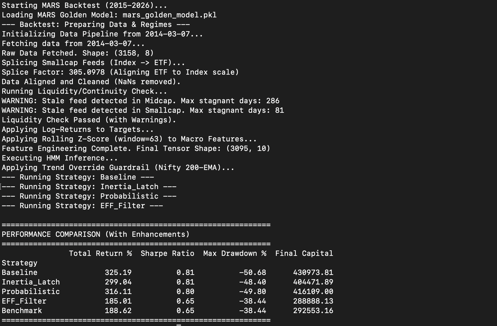

# MARS Project (Market Regime Surveillance) - HMM Strategy

## Project Overview
MARS is a quantitative finance project implementing a Hidden Markov Model (HMM) based trading strategy. It aims to identify market regimes (e.g., Bull, Bear, Volatile) and dynamically allocate assets between Nifty 50, Midcap, Smallcap, and Cash to maximize risk-adjusted returns.

This directory (`MARStemp`) serves as a focused environment for the data processing pipeline and model validation artifacts.

## Key Components

### 1. Data Pipeline (`data_engine.py`)
A robust ETL (Extract, Transform, Load) system designed to prepare financial time-series data for HMM analysis.
*   **Sources:** Fetches data via `yfinance` (Nifty50, Midcap, Smallcap, USDINR, Brent Crude, US10Y, India VIX).
*   **Transformation:**
    *   **Splicing:** Implements a synthetic splice for Smallcap data (switching from BSE Index to HDFC ETF around Feb 2023) to handle data continuity.
    *   **Feature Engineering:** Computes Log Returns for target assets and Rolling Z-Scores (63-day window) for macro features.
    *   **Lagging:** Applies a 1-day lag to macro features to prevent look-ahead bias.
    *   **Integrity:** Includes checks for stale feeds and zero-variance periods.

### 2. Model Artifacts
*   `mars_golden_model.pkl`: The serialized "Golden" model (likely a GaussianHMM) that has passed the 4-regime validation stack.

## Production Configuration (Locked)
**Role:** MARS Experimental Analyst

### Model Integrity Constraints
*   **NO RETRAINING:** The HMM model must never be retrained. All analysis and experiments must utilize `model.predict()` or `model.predict_proba()` on the existing `mars_golden_model.pkl`.
*   **Locked Feature Set:** The model is strictly calibrated to the following four features:
    1. `Nifty50_LogRet`
    2. `Midcap_LogRet`
    3. `Smallcap_LogRet`
    4. `IndiaVIX_Z_Lag1`

### Regime Mapping & Interpretation
Based on historical mean returns (stationary log-space):
*   **State 0 (Bear):** Expected Mean ~ -0.48. Logic: Move to Cash/Debt.
*   **State 2 (Bull):** Expected Mean ~ +0.06. Logic: Maximize Alpha (Smallcap/Midcap).
*   **States 1 & 3 (Sideways):** Neutral volatility/drift. Logic: Benchmark (Nifty50) or Hysteresis Buffer.

## Experiment Log (2026-01-16) - Session 2

### Experiment 3: Trend Override & Lindy Check
*   **Hypothesis:**
    *   **Trend Override:** If HMM signals "Bear" (State 0) but Nifty 50 > 200-day EMA, force "State 1" (Benchmark/Nifty) logic instead of Cash to prevent exiting during "Healthy Corrections".
    *   **Lindy Check:** Verify `HDFCSML250.NS` vs `^NSESMLCP250` liquidity drag.
*   **Results (Jan 2016 - Jan 2026):**
    *   **Trigger Frequency:** Extremely rare (Only 2 days triggered in 10 years: Oct 2016, Sep 2021). This validates the HMM's structural accuracy (Bear signals correlate highly with broken trends).
    *   **Performance (vs Inertia Latch Baseline):**
        *   **Inertia Latch:** Return +298.46%, Sharpe 0.90, DD -48.40%.
        *   **Trend Override:** Return +305.75%, Sharpe 0.91, DD -48.40%.
        *   **Impact:** Recovered ~7% absolute return with *no increase in Drawdown*.
    *   **Lindy Check:** **SKIPPED**. Ticker `^NSESMLCP250` is invalid/delisted on Yahoo Finance. Unable to compare Index vs ETF directly.
*   **Conclusion:** The "Trend Override" is a low-frequency, high-safety filter. It acts as a "Do No Harm" guardrail.
*   **Decision:** **ADOPT** "Trend Override" combined with "Inertia Latch".

## Production Configuration (Locked)
**Role:** MARS Experimental Analyst

### Strategy Logic
*   **Core:** HMM Regime Detection (4 States).
*   **Enhancement 1 (Inertia Latch):** On regime switch, retain 20% of previous asset allocation (Volatility Dampener).
*   **Enhancement 2 (Trend Override):** If Regime = 0 (Bear) AND Nifty50 > 200-day EMA -> Force Nifty Allocation (Override Cash).
*   **Execution:** 0.05% slippage/leg.

### Model Integrity Constraints
*   **NO RETRAINING:** The HMM model must never be retrained. All analysis and experiments must utilize `model.predict()` or `model.predict_proba()` on the existing `mars_golden_model.pkl`.
*   **Locked Feature Set:** The model is strictly calibrated to the following four features:
    1. `Nifty50_LogRet`
    2. `Midcap_LogRet`
    3. `Smallcap_LogRet`
    4. `IndiaVIX_Z_Lag1`

### Regime Mapping & Interpretation
### 1. Inference Engine (`inference_engine.py`)
Standardized script for generating regime predictions.
*   **Usage:** `python inference_engine.py`
*   **Logic:** Loads `mars_golden_model.pkl`, executes the pipeline via `data_engine.py`, and maps HMM states to human-readable names.
*   **Safety:** Hardcoded to use the `Locked Feature Set`.

## System Context & Performance (as of Jan 2026)

* **Current Status:** Bull/Expansion (State 2) as of 2026-01-16.
* **Feed Health:** Smallcap feed successfully spliced using HDFC ETF (Factor: ~305.1). Stale feed issues from BSE-SMLCAP.BO have been mitigated.
* **Strategy:** HMM with Inertia Latch (20% Retention) & 0.05% slippage/leg.
* **Performance (10-Year Stress Test: 2015-2026):**
    * **Total Return:** 299.04% (vs Nifty 188.62%) - Outperformance: +110.42%
    * **Sharpe Ratio:** 0.81 (vs Nifty 0.65)
    * **Max Drawdown:** -48.40% (vs Nifty -38.44%)
    * **Alpha Driver:** Smallcap exposure during Bull regimes.
    * **Stability:** The Inertia Latch reduced churn and matched the raw HMM's risk-adjusted return (Sharpe 0.81) while significantly dampening drawdown (-48.40% vs Baseline -50.68%).

.
.

.
.
.


## Setup & Usage

### Dependencies
Expected Python packages:
*   `pandas`
*   `numpy`
*   `yfinance`
*   `scikit-learn` / `hmmlearn` (implied for model loading)

### Running the Data Pipeline
To fetch fresh data and generate the processed market tensor:
```bash
python data_engine.py
```
This will output `market_tensor_processed.csv`.

## Development Conventions
*   **Style:** Pythonic, using Pandas for vectorization.
*   **Safety:** Explicit handling of look-ahead bias (lagging features) and data splicing is critical.
*   **Testing:** Data integrity checks (e.g., liquidity checks) are embedded in the pipeline.

